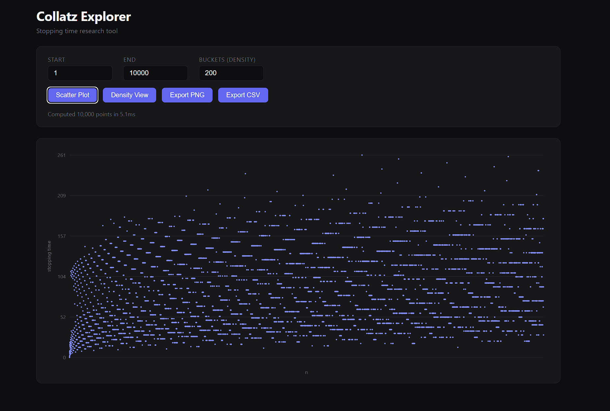

# Collatz Explorer

A research-driven Collatz stopping time explorer featuring interactive scatter plots, density heatmaps, zoom, and data export.

Built to support original mathematical investigation into the structure of the Collatz conjecture, one of the most famous unsolved problems in mathematics.



---

## What is the Collatz Conjecture?

Take any positive integer `n` and apply two rules repeatedly:

- If `n` is even → divide by 2
- If `n` is odd → multiply by 3 and add 1

The conjecture states that every number eventually reaches 1. This has never been proven, despite being verified computationally up to 2^68. The **stopping time** is how many steps a number takes to reach 1, and when plotted across ranges, rich structural patterns emerge.

---

## Tech Stack

| Layer | Technology |
|---|---|
| Computation engine | Rust → WebAssembly (wasm-pack) |
| Frontend | TypeScript + Vite |
| Visualization | Canvas API + D3.js |
| Worker | Web Workers (off-thread compute) |

The Rust engine compiles to WASM and runs inside a Web Worker, keeping the UI fully responsive even over large ranges. Stopping times for 10,000 numbers compute in ~12ms.

---

## Features

- **Scatter plot** — stopping time vs `n` across any range
- **Density view** — bucketed average and max stopping times as a heatmap bar chart
- **Export PNG** — save the current visualization
- **Export CSV** — download raw stopping time data for external analysis
- **Range controls** — configurable start, end, and bucket count

---

## Project Structure

```text
collatz-explorer/
├── engine/                  # Rust WASM crate
│   ├── src/lib.rs           # Core Collatz engine (stopping_time, compute_range, compute_density)
│   └── pkg/                 # Compiled WASM output (generated)
└── web/                     # Vite + TypeScript frontend
    └── src/
        ├── worker/          # Web Worker — calls WASM, returns structured data
        ├── renderer/        # Canvas scatter and density renderers
        ├── ui/              # Controls and export logic
        ├── types.ts         # Shared TypeScript interfaces
        └── main.ts          # App entry point
```

---

## Getting Started

**Prerequisites**

- Rust + `rustup` (https://rustup.rs)
- `wasm-pack` (`cargo install wasm-pack`)
- Node.js 18+

**Build the WASM engine**

```bash
cd engine
wasm-pack build --target web --out-dir pkg
```

**Run the frontend**

```bash
cd web
npm install
npm run dev
```

Open `http://localhost:5173`

---

## Roadmap

### Phase 1 — Research Usability
- [ ] Zoom and pan on scatter plot
- [ ] Tooltip on hover showing exact `n` and stopping time
- [ ] Click to select and inspect individual points

### Phase 2 — Visual Depth
- [ ] Color dots by stopping time intensity (gradient from low to high)
- [ ] Record breaker highlighting — mark every `n` with a higher stopping time than all preceding numbers
- [ ] Axis tick labels that update with zoom level

### Phase 3 — Research Features
- [ ] Sequence tracer — click any point and animate its full Collatz path
- [ ] Statistics panel — mean, median, std deviation, top 10 outliers for visible range
- [ ] Anomaly detection — automatically flag statistically unusual stopping times

### Phase 4 — Polish
- [ ] URL state encoding — share a specific range and zoom level via link
- [ ] Compare mode — overlay two ranges on the same plot
- [ ] Mobile touch support (pinch to zoom)
- [ ] Light mode

---

## Goals

This project exists at the intersection of systems programming and mathematical research. The goals are:

1. **Performance** — push the limits of what's computable in a browser using Rust/WASM
2. **Research utility** — build something a mathematician could actually use to explore patterns
3. **Education** — make the structure of an unsolved problem visually accessible

---

## License

See [LICENSE](LICENSE)